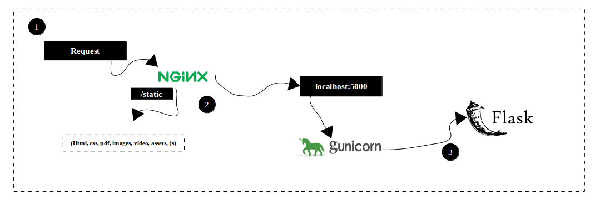

# A personal website template that runs with Flask, Gunicorn, Nginx

## Requirements

1. flask
2. gunicorn
3. nginx
4. git

## Steps

1. sudo apt-get update
2. sudo apt-get install software-properties-common
3. sudo add-apt-repository universe
4. sudo add-apt-repository ppa:certbot/certbot
5. sudo apt-get update
6. sudo apt-get -y install certbot python3-certbot-nginx
7. sudo apt-get -y install python3-pip
8. sudo apt-get -y install git
9. pip3 install flask gunicorn
10. sudo certbot --nginx
11. git clone https://github.com/gcpcodingbook/personal_web_page_template.git
12. cd personal_web_page_template
13. gunicorn app:app --reload-engine auto

### nginx stuff

1. Open a new ssh terminal
2. sudo rm /etc/nginx/sites-enabled/default
3. sudo vim /etc/nginx/sites-enabled/flask_settings
4. Add the below code to flask_settings:

   server { 
   listen 80; 
   listen 443 ssl http2; 
   ssl_certificate /etc/letsencrypt/live/<your_doamin>/fullchain.pem; 
   ssl_certificate_key /etc/letsencrypt/live/<your_domain>/privkey.pem; 
   location / { 
   proxy_pass http://127.0.0.1:8000; 
   proxy_set_header Host $host; 
    proxy_set_header X-Real-IP $remote_addr; 
   } 
   } 

5. sudo nginx -s stop
6. sudo nginx
